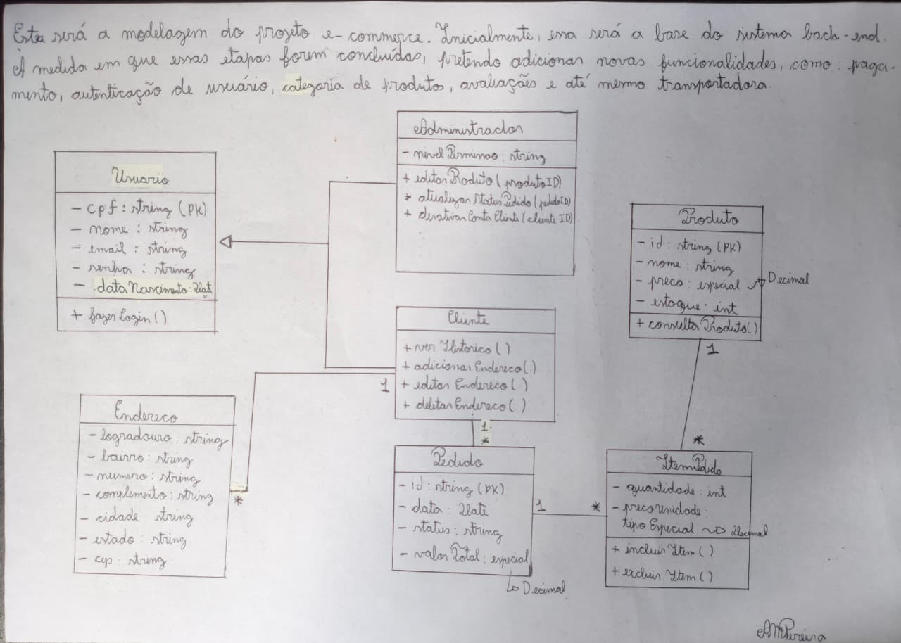

# **E-commerce Back-end API**

Este projeto é o back-end de um sistema de e-commerce, desenvolvido com foco na consolidação de boas práticas de arquitetura de software, Programação Orientada a Objetos e desenvolvimento de API com TypeScript e Node.js.

## **Diagrama de Classes**

A arquitetura inicial do sistema está baseada no seguinte diagrama de classes:



## **Pré-requisitos**

Antes de começar, você vai precisar ter instalado em sua máquina as seguintes ferramentas:

- [Node.js]
- [Git]

## **Como executar o projeto localmente**

```bash
# 1) Clone este repositório:

    git clone https://github.com/AndrePereira03/e-commerce.git

# 2) Acesse a pasta do projeto

    cd e-commerce

# 3) Instale as dependências

    npm install

# 4) Rode a aplicação em modo de desenvolvimento
    npm run dev

# 5) acesse o localhost
```
